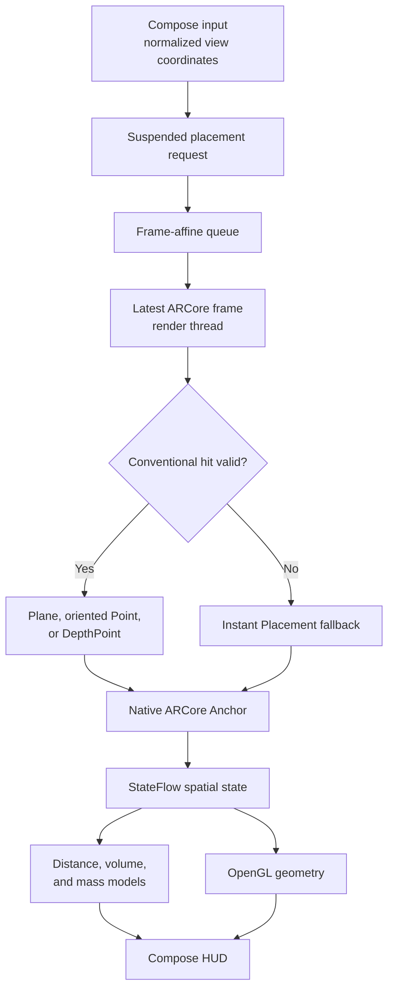

# Aetheris

[](https://github.com/maurizioprizzi/aetheris/actions/workflows/android.yml)
[](LICENSE)
[](https://kotlinlang.org)
[](https://developers.google.com/ar)
[](https://developer.android.com/guide/topics/graphics/opengl)
[](https://developer.android.com/guide/practices/page-sizes)
[](https://developer.android.com)
[](https://developer.android.com)

**Aetheris** is an open-source experimental spatial metrology platform for Android.

It combines ARCore tracking, native anchors, spatial raycasting, point-cloud filtering, OpenGL ES 3.0 graphics, and Jetpack Compose to measure distances, calculate approximate 3D bounding-box volumes, and estimate object mass from a user-selected material density.

The project explores mobile spatial computing, real-time graphics, Unidirectional Data Flow (UDF), frame-affine ARCore processing, and uncertainty-aware physical modeling.

> [!IMPORTANT]
> Aetheris is an experimental spatial computing system, not a certified metrological instrument or a substitute for a calibrated scale. Results depend on device hardware, camera calibration, lighting, surface texture, ARCore tracking stability, object geometry, and the selected material density.

---

## Current capabilities

| Capability | Status | Description |
| :--- | :--- | :--- |
| **ARCore camera background** | Implemented | Camera rendering through a zero-copy `GL_TEXTURE_EXTERNAL_OES` pipeline. |
| **OpenGL ES 3.0 graphics** | Implemented | Real-time 3D rendering of measurement lines (`GL_LINES`) and anchor points (`GL_POINTS`). |
| **Point-cloud filtering** | Implemented | Confidence thresholding, non-finite value rejection, and deterministic `PointCloud.close()` lifecycle. |
| **Raycasting and surface gating** | Implemented | Plane polygon gating, oriented feature-point validation, and optional `DepthPoint` support. |
| **Instant Placement fallback** | Implemented | Approximate placement before plane convergence through `LOCAL_Y_UP`, when sufficient visual features are available. |
| **Frame-affine placement queue** | Implemented | Hit tests and anchor creation are queued by the UI and executed against the latest frame on the render thread. |
| **Surface-probe throttling** | Implemented | Continuous conventional surface detection is limited to approximately 5 Hz. |
| **Native anchor tracking** | Implemented | ARCore `Anchor` poses are resolved frame-by-frame as the SLAM map evolves. |
| **Linear distance measurement** | Implemented | Euclidean distance with a documented heuristic uncertainty model. |
| **Sequential three-axis volume** | Implemented | Guided width, height, and depth capture with AABB volume calculation in cubic meters and liters. |
| **Material-density selection** | Implemented | Explicit material selection with density and density uncertainty. |
| **Mass estimation by density** | Implemented | Approximate mass calculation with combined volume and density uncertainty. |
| **World-to-screen projection** | Implemented | Pure Kotlin MVP projection with homogeneous clipping and viewport mapping. |
| **Floating Compose badge** | Implemented | Reactive screen-space badge following the current measurement midpoint. |
| **Debug hit-test diagnostics** | Implemented | Debug-only `AetherisHitTest` logs for conventional hits, Instant Placement, and anchor creation. |
| **Depth API** | Disabled | `DepthMode.DISABLED` is retained because the test device reports native `ComputeDisparity` failures. |
| **Multipoint polylines** | Planned | Sequential multi-node boundary tracking. |
| **3D polygon area** | Planned | Coplanar surface-area calculation and mesh rendering. |
| **Metrological export** | Planned | Structured measurement export in JSON and CSV formats. |

---

## Spatial measurement pipeline



1. **Tracking:** ARCore estimates the six-degree-of-freedom camera pose through visual-inertial odometry.
2. **Point-cloud ingestion:** `ArCoreFrameProcessor` acquires, validates, filters, and closes each available point cloud.
3. **UI request:** The user requests an anchor using normalized view coordinates in the `[0, 1]` range.
4. **Frame-affine execution:** `SpatialSensorRepositoryImpl` suspends the caller and processes the request during the next `onFrameUpdate` on the render thread.
5. **Hit-test priority:** `ArCoreHitTestProcessor` prioritizes tracked planes inside their polygons, oriented feature points, and depth points.
6. **Approximate fallback:** When conventional geometry is unavailable, explicit placement may use an `InstantPlacementPoint` at an initial approximate distance.
7. **Native anchoring:** A successful hit is bound to an ARCore `Anchor`, whose pose is resolved on subsequent frames.
8. **Domain calculation:** Pure Kotlin use cases calculate distance, AABB volume, and density-based mass estimates.
9. **Rendering and projection:** OpenGL renders spatial geometry while the projection use case maps world coordinates into the Compose HUD.

---

## Mathematical models

### 1. Euclidean distance and heuristic uncertainty

For spatial points $P_1(x_1, y_1, z_1)$ and $P_2(x_2, y_2, z_2)$:

$$d = \sqrt{(x_2-x_1)^2 + (y_2-y_1)^2 + (z_2-z_1)^2}$$

The current distance uncertainty model is:

$$u_d = u_{\text{base}}\frac{1 + d/d_{\text{ref}}}{c_{\text{effective}}}$$

This is an engineering heuristic, not a device calibration certificate.

### 2. AABB volume and uncertainty propagation

The sequential width ($w$), height ($h$), and depth ($d$) measurements define an axis-aligned bounding-box estimate:

$$V = w \times h \times d$$

Assuming independent axis uncertainties:

$$u_V = \sqrt{(h \cdot d \cdot u_w)^2 + (w \cdot d \cdot u_h)^2 + (w \cdot h \cdot u_d)^2}$$

### 3. Density-based mass estimation

Given volume $V$ and selected material density $\rho$:

$$m = V \times \rho$$

Assuming independent volume and density uncertainties:

$$u_m = \sqrt{(\rho u_V)^2 + (V u_\rho)^2}$$

The result is an approximation. Hollow objects, mixed materials, irregular geometry, and an incorrect density selection can produce substantial differences from a scale measurement.

---

## Clean Architecture and project structure

The pure Kotlin domain is isolated from Android and ARCore APIs. Framework-specific behavior remains in the data and presentation layers.

```text
org.aetheris.app
├── data
│   ├── arcore
│   │   ├── ArCoreFrameProcessor.kt
│   │   ├── ArCoreHitTestProcessor.kt
│   │   └── ArCoreSessionManager.kt
│   ├── opengl
│   │   ├── BackgroundRenderer.kt
│   │   └── SpatialLineRenderer.kt
│   └── repository
│       └── SpatialSensorRepositoryImpl.kt
├── domain
│   ├── math
│   │   └── SpatialLineMath.kt
│   ├── model
│   │   ├── AnchorSlot.kt
│   │   ├── BoundingBox3D.kt
│   │   ├── DimensionAxis.kt
│   │   ├── DistanceMeasurement.kt
│   │   ├── MassEstimate.kt
│   │   ├── MaterialDensity.kt
│   │   ├── Point3D.kt
│   │   ├── ScreenPoint2D.kt
│   │   ├── SpatialDimensions.kt
│   │   ├── SpatialFrameData.kt
│   │   ├── TrackingStatus.kt
│   │   └── VolumeMeasurement.kt
│   ├── repository
│   │   └── SpatialSensorRepository.kt
│   └── usecase
│       ├── CalculateDistanceUseCase.kt
│       ├── CalculateMassUseCase.kt
│       ├── CalculateVolumeUseCase.kt
│       ├── EstimateSpatialDimensionsUseCase.kt
│       └── ProjectWorldToScreenUseCase.kt
├── presentation
│   ├── components
│   │   ├── ArCameraFeed.kt
│   │   ├── FloatingMeasurementBadge.kt
│   │   ├── MaterialDensitySelector.kt
│   │   └── MeasurementCrosshair.kt
│   └── measurement
│       ├── MeasurementScreen.kt
│       ├── MeasurementUiState.kt
│       └── MeasurementViewModel.kt
├── di
│   └── AppModule.kt
├── AetherisApplication.kt
└── MainActivity.kt
```

The tree above presents the principal components and is not intended as an exhaustive source listing.

---

## Technology stack

- **Language and build:** Kotlin 2.0.20, Gradle Kotlin DSL, Android Gradle Plugin, Version Catalogs.
- **Android configuration:** Min SDK 26, Target SDK 36, JDK 17, 16 KB page-size packaging configured.
- **UI and state:** Jetpack Compose, Material 3, UDF, `StateFlow`, ViewModel.
- **Spatial computing:** ARCore SDK 1.46.0, visual-inertial tracking, planes, point clouds, Instant Placement, and native anchors.
- **Graphics:** OpenGL ES 3.0, GLSL ES 3.0, external OES camera texture, EGL/GLSurfaceView lifecycle.
- **Dependency injection:** Koin with application-level container and Activity-level dependency resolution.
- **Testing:** JUnit 4, MockK, Google Truth, and `kotlinx-coroutines-test`.
- **Quality and CI:** Android Lint, GitHub Actions, debug APK artifact generation.

---

## Testing and quality assurance

The current local baseline is:

```text
128 tests executed
0 failures
Android Lint passed
Debug APK assembled
Physical placement flow validated
```

Run the complete verification pipeline:

```bash
./gradlew testDebugUnitTest lintDebug assembleDebug \
  --no-configuration-cache
```

The physical-device validation confirmed both approximate and conventional placement:

```text
InstantPlacementPoint
tracking=TRACKING
method=SCREENSPACE_WITH_APPROXIMATE_DISTANCE
anchor created successfully
```

After visual tracking matured, ARCore also returned a valid conventional oriented feature point.

---

## Architecture Decision Records

Core engineering decisions are maintained under [`docs/adr`](docs/adr):

- `ADR-001`: Adoption of Koin over Hilt/Dagger.
- `ADR-002`: Apache 2.0 Licensing and Open-Core Strategy.
- `ADR-003`: Pure Kotlin Mathematical Domain Isolation.
- `ADR-004`: First-Class Metrological Uncertainty Modeling.
- `ADR-005`: Reactive Sensor Pipeline via `StateFlow`.
- `ADR-006`: Raycasting and Hit-Testing Abstraction.
- `ADR-007`: Point-Cloud Noise Filtering and Confidence Gating.
- `ADR-008`: Unidirectional Data Flow in the Compose HUD.
- `ADR-009`: Declarative Camera Permission Management.
- `ADR-010`: ARCore Lifecycle and EGL Context Isolation.
- `ADR-011`: Spatial Raycasting and Convex Polygon Gating.
- `ADR-012`: Zero-Copy OES Camera Texture and OpenGL Geometry.
- `ADR-013`: Native ARCore Anchor Tracking and Pose-Graph Correction.
- `ADR-014`: Defensive ARCore/OpenGL Resource Management and Depth Fallback.
- `ADR-015`: Sequential Axis Capture and Uncertainty-Aware AABB Volume.

Planned documentation:

- `ADR-016`: Frame-Affine Placement Queue and Instant Placement Fallback.

---

## Development log

Detailed development history, device diagnostics, mathematical derivations, and regression notes are available in [`DEVLOG.md`](DEVLOG.md).

---

## Build and installation

### Prerequisites

- JDK 17.
- Android Studio or another Android/Gradle-compatible development environment.
- Android SDK 36.
- A physical ARCore-compatible Android device for spatial functionality.
- USB debugging for command-line installation.

### Commands

```bash
# Clone the repository
git clone [https://github.com/maurizioprizzi/aetheris.git](https://github.com/maurizioprizzi/aetheris.git)
cd aetheris

# Ensure executable permissions
chmod +x gradlew

# Run the complete verification pipeline
./gradlew testDebugUnitTest lintDebug assembleDebug \
  --no-configuration-cache

# Install on a connected device
./gradlew installDebug
```

---

## Known limitations

- Measurements depend on ARCore tracking quality and the camera configuration of each device.
- Instant Placement begins with an approximate distance and can update pose or apparent scale as tracking improves.
- The current volume model is an axis-aligned bounding-box approximation, not object segmentation or mesh reconstruction.
- Mass depends directly on the selected density and assumes the measured volume is occupied by that material.
- Hollow, articulated, deformable, reflective, transparent, or low-texture objects can produce inaccurate results.
- Depth remains disabled on the current test configuration because of native device/runtime failures.
- The uncertainty models are explicit engineering estimates and have not yet been validated through a controlled calibration study.

---

## Roadmap

- Formalize `ADR-016` for frame-affine ARCore operations and Instant Placement.
- Validate repeated Activity and ARCore session pause/resume cycles.
- Run controlled measurements against objects with known dimensions, volume, density, and mass.
- Quantify repeatability, bias, and sensitivity to viewing distance and lighting.
- Distinguish approximate placement from confirmed conventional geometry in the HUD.
- Add structured measurement export.
- Explore multipoint boundaries, surface area, and mesh-based volume estimation.

---

## License

Aetheris is distributed under the [Apache License 2.0](LICENSE).

```text
Copyright 2026 Maurizio Prizzi
```