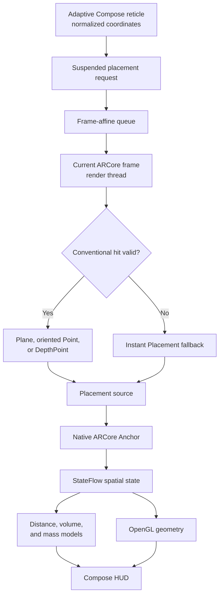

<!-- Artifact revision: README-day18-object-aware-v1 -->

# Aetheris

[](https://github.com/maurizioprizzi/aetheris/actions/workflows/android.yml)
[](LICENSE)
[](https://kotlinlang.org)
[](https://developers.google.com/ar)
[](https://developer.android.com/guide/topics/graphics/opengl)
[](https://developer.android.com/guide/practices/page-sizes)
[](https://developer.android.com)
[](https://developer.android.com)
[](https://github.com/maurizioprizzi/aetheris/releases/tag/v0.1.2-alpha)

**Aetheris** is an open-source experimental spatial measurement platform for Android.

It combines ARCore tracking, native anchors, spatial raycasting, point-cloud filtering, OpenGL ES 3.0 graphics, and Jetpack Compose to measure distances, calculate approximate three-axis volumes, and estimate object mass from a user-selected material density.

The project explores mobile spatial computing, real-time graphics, Unidirectional Data Flow (UDF), frame-affine ARCore processing, and uncertainty-aware physical modeling.

Its evolving object-aware domain foundation now separates measured geometry, reusable object profiles, suggested materials, and physical estimation strategies. Advanced object-specific calculations and automatic visual recognition remain planned work.

> [!IMPORTANT]
> Aetheris is an experimental spatial computing system, not a certified metrological instrument or a substitute for a calibrated scale. Results depend on device hardware, camera calibration, lighting, surface texture, ARCore tracking stability, object geometry, placement method, and the selected material density.

---

## Current capabilities

| Capability | Status | Description |
| :--- | :--- | :--- |
| **ARCore camera background** | Implemented | Camera rendering through a zero-copy `GL_TEXTURE_EXTERNAL_OES` pipeline. |
| **OpenGL ES 3.0 graphics** | Implemented | Real-time 3D rendering of measurement lines (`GL_LINES`) and anchor points (`GL_POINTS`). |
| **Point-cloud filtering** | Implemented | Confidence thresholding, non-finite value rejection, and deterministic `PointCloud.close()` lifecycle. |
| **Raycasting and surface gating** | Implemented | Plane polygon gating, oriented feature-point validation, and optional `DepthPoint` recognition. |
| **Instant Placement fallback** | Implemented | Approximate placement through `LOCAL_Y_UP` when explicit placement is requested before conventional geometry converges. |
| **Frame-affine placement queue** | Implemented | UI requests are queued and executed against the current ARCore frame on the OpenGL rendering thread. |
| **Surface-probe throttling** | Implemented | Continuous conventional surface detection is limited to approximately 5 Hz. |
| **Native anchor tracking** | Implemented | ARCore `Anchor` poses are resolved frame by frame as the SLAM map evolves. |
| **Anchor placement provenance** | Implemented | Positions retain whether they originated from a plane, feature point, depth point, or Instant Placement. |
| **Confirmed dimension provenance** | Implemented | Each width, height, and depth measurement preserves the source of both anchors after confirmation. |
| **Linear distance measurement** | Implemented | Euclidean distance with an explicit heuristic uncertainty model. |
| **Sequential three-axis volume** | Implemented | Guided width, height, and depth capture with approximate volume calculation in cubic meters and liters. |
| **Material-density selection** | Implemented | Explicit material selection using catalogued density and density uncertainty. |
| **Mass estimation by density** | Implemented | Approximate mass calculation with combined volume and density uncertainty. |
| **Physical estimation strategies** | Domain implemented | Explicit models for homogeneous solids, occupancy-adjusted volumes, panel assemblies, shells, component compositions, and empirical references. |
| **Reusable object profiles** | Domain implemented | Validated profiles associate stable identifiers, descriptions, recommended physical strategies, and unconfirmed material suggestions. |
| **Manual object profile catalog** | Domain implemented | Initial deterministic profiles for homogeneous solids, books, containers, and panel furniture; presentation integration remains pending. |
| **Object-aware mass calculation** | Planned | Strategy-specific calculations with explicit structural parameters, model provenance, and additional uncertainty. |
| **Automatic object recognition** | Planned | Ranked visual suggestions with confidence, model version, and mandatory user confirmation or correction. |
| **World-to-screen projection** | Implemented | Pure Kotlin MVP projection with homogeneous clipping and viewport mapping. |
| **Floating Compose badge** | Implemented | Reactive screen-space badge following the current measurement midpoint. |
| **Adaptive measurement reticle** | Implemented | The reticle remains visible above the dynamically measured control panel, and its actual normalized position drives ARCore hit testing. |
| **Debug hit-test diagnostics** | Implemented | Debug-only `AetherisHitTest` logs for conventional hits, Instant Placement, and anchor creation. |
| **Depth API** | Disabled | `DepthMode.DISABLED` is retained because the test device reports native `ComputeDisparity` failures. |
| **Placement provenance in HUD** | Implemented | The interface distinguishes conventional placement from approximate Instant Placement and exposes confirmed measurement quality. |
| **Automated tagged releases** | Implemented | Version tags trigger validation, testing, lint, APK assembly, SHA-256 generation, and GitHub Release publication. |
| **Multipoint polylines** | Planned | Sequential multi-node boundary tracking. |
| **3D polygon area** | Planned | Coplanar surface-area calculation and mesh rendering. |
| **Structured export** | Planned | Measurement export in JSON and CSV formats. |

---

## Spatial measurement pipeline



1. **Tracking:** ARCore estimates the six-degree-of-freedom camera pose through visual-inertial odometry.
2. **Point-cloud ingestion:** `ArCoreFrameProcessor` acquires, validates, filters, and closes each available point cloud.
3. **Adaptive target:** Compose measures the control-panel bounds, keeps the reticle visible in the available camera region, and publishes its normalized coordinates in the `[0, 1]` range.
4. **Frame-affine execution:** `SpatialSensorRepositoryImpl` suspends the caller and processes the request during a subsequent `onFrameUpdate(frame)` invocation on the render thread.
5. **Hit-test priority:** `ArCoreHitTestProcessor` prioritizes tracked planes inside their polygons, oriented feature points, and depth points.
6. **Approximate fallback:** When conventional geometry is unavailable, explicit placement may use an `InstantPlacementPoint` with an initial approximate distance.
7. **Provenance classification:** The selected hit is classified as `PLANE`, `FEATURE_POINT`, `DEPTH_POINT`, or `INSTANT_PLACEMENT`.
8. **Native anchoring:** A successful hit is bound to an ARCore `Anchor`, whose pose is resolved on subsequent frames while its original source is preserved.
9. **Reactive propagation:** Position and provenance travel together through `SpatialFrameData`, `MeasurementViewModel`, and `MeasurementUiState`.
10. **Dimension confirmation:** `DimensionMeasurement` preserves the distance and both anchor sources when an axis is committed to `SpatialDimensions`.
11. **Domain calculation:** Pure Kotlin use cases calculate distance, approximate three-axis volume, and density-based mass estimates.
12. **Rendering and projection:** OpenGL renders spatial geometry while the projection use case maps world coordinates into the Compose HUD.

---

## Mathematical models

### 1. Euclidean distance and heuristic uncertainty

For spatial points $P_1(x_1, y_1, z_1)$ and $P_2(x_2, y_2, z_2)$:

$$d = \sqrt{(x_2-x_1)^2 + (y_2-y_1)^2 + (z_2-z_1)^2}$$

The current distance uncertainty model is:

$$u_d = u_{\text{base}}\frac{1 + d/d_{\text{ref}}}{c_{\text{effective}}}$$

This is an engineering heuristic, not a device calibration certificate.

### 2. Three-axis volume and uncertainty propagation

The sequential width ($w$), height ($h$), and depth ($d$) measurements define an approximate bounding volume:

$$V = w \times h \times d$$

Assuming independent axis uncertainties:

$$u_V = \sqrt{(h \cdot d \cdot u_w)^2 + (w \cdot d \cdot u_h)^2 + (w \cdot h \cdot u_d)^2}$$

### 3. Density-based mass estimation

Given volume $V$ and selected material density $\rho$:

$$m = V \times \rho$$

Assuming independent volume and density uncertainties:

$$u_m = \sqrt{(\rho u_V)^2 + (V u_\rho)^2}$$

The result is an approximation. Hollow objects, mixed materials, irregular geometry, and an incorrect density selection can produce substantial differences from a scale measurement.

The current calculation corresponds specifically to the `HOMOGENEOUS_SOLID` strategy. Other object profiles must not reuse it until their structural parameters and strategy-specific calculations are implemented.

---

## Object-aware estimation foundation

Aetheris now defines a deterministic domain foundation for future object-aware estimation. Reusable profiles describe object archetypes and recommend physical strategies, but they do not represent an observed object and do not confirm its material or construction.

### Physical strategies

| Strategy | Intended physical model | Calculation status |
| :--- | :--- | :--- |
| `HOMOGENEOUS_SOLID` | The measured external volume is predominantly occupied by one material. | Implemented through the existing density-based mass use case. |
| `OCCUPANCY_ADJUSTED` | External volume multiplied by an explicit occupied fraction. | Domain defined; parameters and calculation pending. |
| `PANEL_ASSEMBLY` | Sum of structural panel volumes derived from dimensions and thicknesses. | Domain defined; parameters and calculation pending. |
| `SHELL_OR_CONTAINER` | Material volume derived from external and internal geometry. | Domain defined; parameters and calculation pending. |
| `COMPONENT_COMPOSITION` | Sum of components with potentially different geometries and materials. | Domain defined; parameters and calculation pending. |
| `EMPIRICAL_REFERENCE` | Traceable reference data with an applicability range and uncertainty. | Domain defined; reference model and calculation pending. |

### Initial manual profiles

| Profile | Recommended strategy | Current material suggestions | Current availability |
| :--- | :--- | :--- | :--- |
| Generic homogeneous solid | `HOMOGENEOUS_SOLID` | Wood, polypropylene, aluminum, structural steel, solid glass, and concrete. | Domain catalog; current calculation compatible. |
| Book | `COMPONENT_COMPOSITION` | None until paper, cardboard, coatings, and adhesives have documented references. | Domain catalog; calculation pending. |
| Container | `SHELL_OR_CONTAINER` | Polypropylene, aluminum, and solid glass. | Domain catalog; calculation pending. |
| Panel furniture | `PANEL_ASSEMBLY` | Generic wood as a provisional suggestion. | Domain catalog; MDF and plywood references pending. |

Profile selection is not yet exposed in the Compose interface. Future recognition will produce suggestions rather than silently deciding object type, material, or physical construction.

---

## Clean Architecture and project structure

The pure Kotlin domain is isolated from Android and ARCore APIs. Framework-specific behavior remains in the data and presentation layers.

| Layer | Path | Responsibility | Principal components |
| :--- | :--- | :--- | :--- |
| **Data / ARCore** | `data/arcore` | Session lifecycle, point-cloud processing, raycasting, and anchor creation | `ArCoreSessionManager`, `ArCoreFrameProcessor`, `ArCoreHitTestProcessor` |
| **Data / OpenGL** | `data/opengl` | Camera background and spatial geometry rendering | `BackgroundRenderer`, `SpatialLineRenderer` |
| **Data / Repository** | `data/repository` | Frame-affine request coordination and reactive spatial state | `SpatialSensorRepositoryImpl` |
| **Domain / Math** | `domain/math` | Framework-independent spatial line operations | `SpatialLineMath` |
| **Domain / Models** | `domain/model` | Immutable measurement, geometry, provenance, quality, density, object-profile, strategy, volume, and mass models | `Point3D`, `AnchorPlacement`, `AnchorPlacementSource`, `DistanceMeasurement`, `DimensionMeasurement`, `SpatialDimensions`, `SpatialMeasurementQuality`, `VolumeMeasurement`, `MaterialDensity`, `MaterialDensityCatalog`, `PhysicalEstimationStrategy`, `ObjectProfile`, `ObjectProfileCatalog`, `MassEstimate` |
| **Domain / Repository** | `domain/repository` | Framework-independent spatial sensor contract | `SpatialSensorRepository` |
| **Domain / Use cases** | `domain/usecase` | Distance, projection, dimensions, volume, and mass calculations | `CalculateDistanceUseCase`, `ProjectWorldToScreenUseCase`, `EstimateSpatialDimensionsUseCase`, `CalculateVolumeUseCase`, `CalculateMassUseCase` |
| **Presentation / Components** | `presentation/components` | AR camera integration and reusable Compose interface elements | `ArCameraFeed`, `FloatingMeasurementBadge`, `MaterialDensitySelector` |
| **Presentation / Measurement** | `presentation/measurement` | UDF state, orchestration, and measurement screen | `MeasurementUiState`, `MeasurementViewModel`, `MeasurementScreen` |
| **Presentation / Permissions** | `presentation/permissions` | Declarative camera-permission flow | `CameraPermissionHandler` |
| **Dependency injection** | `di` | Application dependency graph | `AppModule` |

---

## Technology stack

- **Language and build:** Kotlin 2.0.20, Gradle Kotlin DSL, Android Gradle Plugin, and Version Catalogs.
- **Android configuration:** Min SDK 26, Target SDK 36, and JDK 17.
- **UI and state:** Jetpack Compose, Material 3, UDF, `StateFlow`, and ViewModel.
- **Spatial computing:** ARCore SDK 1.46.0, visual-inertial tracking, planes, point clouds, Instant Placement, and native anchors.
- **Graphics:** OpenGL ES 3.0, GLSL ES 3.0, external OES camera texture, and EGL/`GLSurfaceView` lifecycle management.
- **Dependency injection:** Koin with an application-level container and Activity-level dependency resolution.
- **Testing:** JUnit 4, MockK, Google Truth, and `kotlinx-coroutines-test`.
- **Quality and CI:** Android Lint, GitHub Actions, clean debug builds, version-to-tag validation, and automated APK release publication.

---

## Testing and quality assurance

The current validation baseline includes:

- A passing JVM unit-test suite.
- Dedicated tests for domain models, mathematical operations, physical strategies, object profiles, catalog integrity, use cases, presentation state, ViewModel behavior, ARCore processors, and repository coordination.
- Explicit regression coverage for placement-source classification, conventional-hit priority, provenance propagation, confirmed per-axis provenance, adaptive target coordinates, anchor replacement, paused tracking, cleanup, confirmation, and reset.
- Android Lint passing without blocking errors.
- Successful clean debug APK assembly.
- Physical-device validation of approximate and conventional anchor placement.
- Physical-device validation of the dynamically positioned reticle and its matching ARCore target coordinates.

Run the complete verification pipeline:

```bash
./gradlew clean testDebugUnitTest lintDebug assembleDebug \
  --no-configuration-cache
```

Physical-device diagnostics confirmed successful approximate placement:

```text
InstantPlacementPoint
tracking=TRACKING
method=SCREENSPACE_WITH_APPROXIMATE_DISTANCE
anchor created successfully
```

After visual tracking matured, ARCore also returned a valid conventional oriented feature point.

---

## Architecture Decision Records

The ADR registry is available in [`docs/adr`](docs/adr/README.md).

Available standalone records include:

- [`ADR-016: Frame-Affine Placement Queue and Instant Placement Fallback`](docs/adr/ADR-016-frame-affine-placement.md)
- [`ADR-017: Anchor Placement Provenance and Approximation Semantics`](docs/adr/ADR-017-anchor-placement-provenance.md)
- [`ADR-018: Object-Aware Physical Estimation`](docs/adr/ADR-018-object-aware-physical-estimation.md)

Decisions ADR-001 through ADR-015 were originally recorded in `DEVLOG.md` and are being migrated gradually into standalone documents. The registry reports their migration status explicitly.

---

## Development log

Detailed development history, device diagnostics, mathematical derivations, and regression notes are available in [`DEVLOG.md`](DEVLOG.md).

---

## Build and installation

### Current pre-release

The current public pre-release is available on GitHub:

- [`Aetheris v0.1.2-alpha`](https://github.com/maurizioprizzi/aetheris/releases/tag/v0.1.2-alpha)

The downloadable artifact is a Debug APK intended for evaluation on compatible physical devices. It is not a production-signed release.

Version tags matching the application's `versionName` activate the release workflow. The workflow runs the complete validation pipeline, creates a versioned APK and SHA-256 checksum, and publishes both files in the corresponding GitHub Release.

### Prerequisites

- JDK 17.
- Android Studio or another Android/Gradle-compatible development environment.
- Android SDK 36.
- A physical ARCore-compatible Android device for spatial functionality.
- USB debugging for command-line installation.

### Commands

```bash
# Clone the repository
git clone https://github.com/maurizioprizzi/aetheris.git
cd aetheris

# Ensure executable permissions
chmod +x gradlew

# Run the complete verification pipeline
./gradlew clean testDebugUnitTest lintDebug assembleDebug \
  --no-configuration-cache

# Install on a connected device
./gradlew installDebug
```

---

## Known limitations

- Measurements depend on ARCore tracking quality and the camera configuration of each device.
- Instant Placement begins with an approximate distance and can update pose or apparent scale as tracking improves.
- Approximate placement is identified in the HUD and preserved with confirmed dimensions, but an explicit acceptance or rejection policy has not yet been defined for mixed-source measurements.
- The current volume model is a three-axis bounding approximation, not object segmentation or mesh reconstruction.
- The executable mass calculation currently supports only the homogeneous-solid assumption: selected density multiplied by the complete measured volume.
- Object profiles and advanced physical strategies exist in the pure Kotlin domain but are not yet connected to measurement state or the Compose interface.
- Books, containers, panel furniture, composite objects, and partially occupied volumes do not yet have executable strategy-specific mass calculations.
- Hollow, articulated, deformable, reflective, transparent, or low-texture objects can produce inaccurate results.
- Depth remains disabled on the current test configuration because of native device/runtime failures.
- 16 KB page-size compatibility is still under explicit release-artifact validation.
- The uncertainty models are engineering estimates and have not yet been validated through a controlled calibration study.

---

## Roadmap

- Define an explicit confirmation policy for measurements containing approximate points.
- Preserve provenance in future persisted and exported measurement records.
- Document adaptive reticle geometry and end-to-end target consistency in a standalone ADR.
- Add documented density references and uncertainties for paper, cardboard, MDF, plywood, coatings, and adhesives.
- Define validated parameter models for occupancy, panels, shells, components, and empirical references.
- Implement and test one object-aware mass strategy at a time while preserving the existing homogeneous-solid calculation.
- Expose deterministic manual object-profile selection and explicit assumption confirmation in the Compose workflow.
- Introduce ranked visual object suggestions only after the manual workflow and physical models are validated.
- Validate repeated Activity and ARCore session pause/resume cycles.
- Run controlled measurements against objects with known dimensions, volume, density, and mass.
- Quantify repeatability, bias, and sensitivity to viewing distance, lighting, and surface texture.
- Validate 16 KB page-size compatibility against the release artifact.
- Add structured measurement export.
- Explore multipoint boundaries, surface area, and mesh-based volume estimation.
- Migrate ADR-001 through ADR-015 into standalone architecture records.

---

## License

Aetheris is distributed under the [Apache License 2.0](LICENSE).

```text
Copyright 2026 Maurizio Prizzi
```
